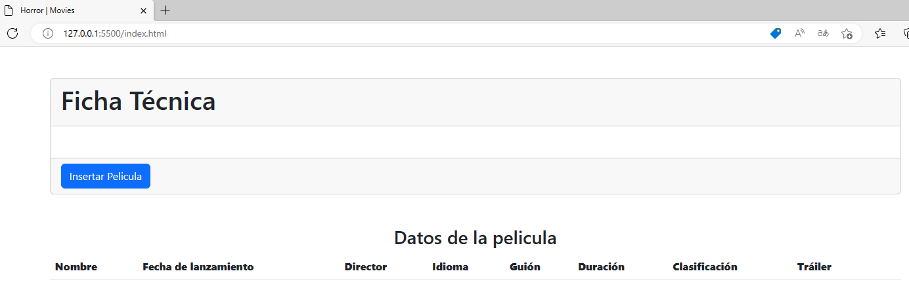

# **[ Práctica 2 ]** JavaScript + FireBase.

_► Archivo index.js:_ [JSCode](./index.js)

_► Archivo index.html:_ [HTMLCode](./index.html)

_► Archivo data.json:_ [BancoPeliculas](./data.json)

## Muestras del Programa

**1.** Vista general al ejecutar el programa.

**2.** Momento de inserción aleatoria de una película por el usuario.

-Tabla generada que contiene las inserciones realizadas.

## Fragmentos de Código

►Información de la base de datos generada con FireBase implementado en el archivo [index.js](./index.js)

►Vista de la película insertada en FireBase.

