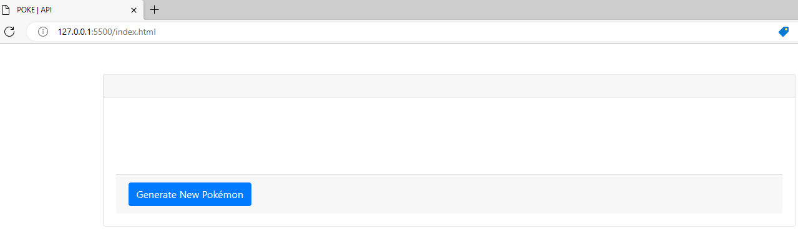
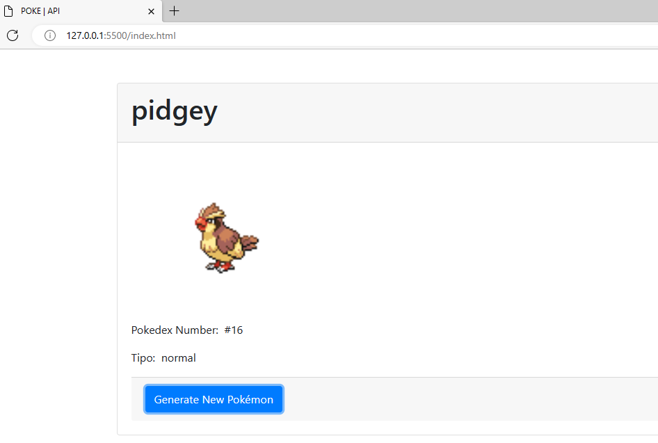
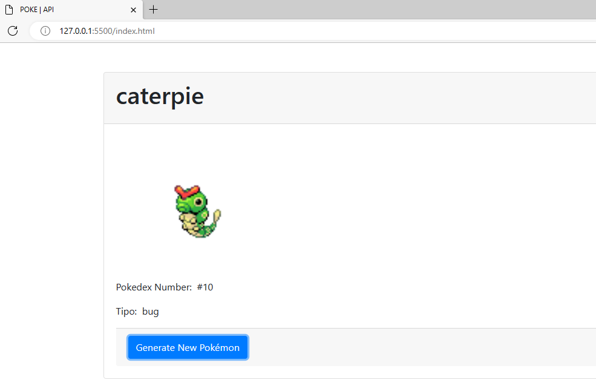

# **[ Práctica 1 ]** Consumo de una API.

► Link de la API utilizada: [PokeAPI](https://pokeapi.co/)

_► Código Implementado:_ [Pokedex](./index.html)

## Muestras del Programa

**1.** Vista general del programa.

**2.** Ejecución del programa (Consumo de la API).

